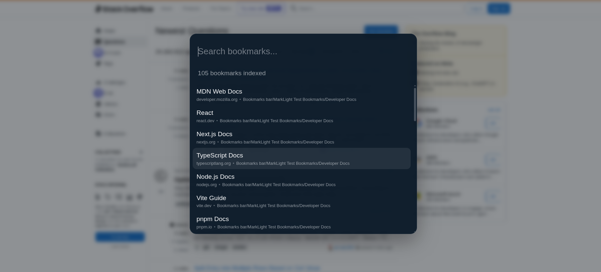
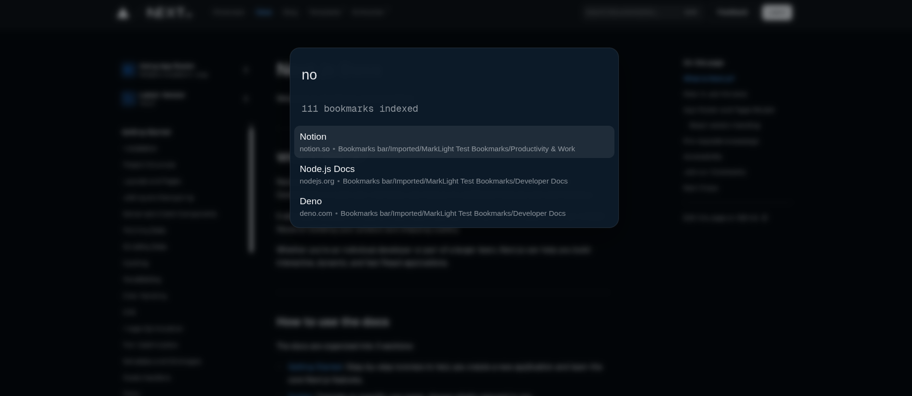

# Marklight

Marklight is a keyboard-first bookmark launcher for Chrome. Open it on any page, type a few letters, move with the arrow keys, and jump straight to the bookmark you want.

It is built for people who have too many bookmarks for the bookmarks bar, too many folders for the default manager, and no patience for hunting through nested menus.

## Why Marklight

- Fast access to bookmarks from anywhere in the browser
- Keyboard-first interaction with no tab switching required
- Lightweight in-page launcher instead of a heavy management UI
- Built around speed, accuracy, and low friction

## Screenshots

### Launcher open with live search

### Ranked results with keyboard-first navigation

## Current Performance

Current measurements captured across three bookmark profile sizes.

| Profile Name    | Bookmark Count | Cold Run (ms) | Warm Runs (ms) | Warm Avg (ms) |
| --------------- | -------------: | ------------: | -------------: | ------------: |
| Minimal Profile |             20 |           0.0 |            0.1 |          0.03 |
| Medium Profile  |             65 |           0.2 |            0.0 |          0.00 |
| High Profile    |            105 |           0.3 |            0.2 |          0.10 |

Notes:

- Cold run = first `GET_BOOKMARKS` request in the service worker lifecycle
- Warm runs = subsequent requests without restarting the service worker
- Data source = captured console output from development instrumentation
- Values are rounded to two decimal places in logs; very small durations can appear as 0.00 ms

## Core Experience

Marklight currently focuses on one job: getting you to the right bookmark quickly.

- Global launcher shortcut: `Ctrl+Shift+K` on Windows/Linux, `Command+Shift+K` on macOS
- Search by bookmark title, URL text, domain, and folder path
- Arrow key navigation through results
- `Enter` opens the selected bookmark in the current tab
- `Ctrl+Enter` or `Command+Enter` opens the selected bookmark in a new tab
- `Escape` closes the launcher instantly
- Empty query shows an initial list so you can browse without typing

## How It Works

1. Trigger the launcher from the current tab.
2. Start typing a bookmark title, URL fragment, domain, or folder name.
3. Marklight ranks matching bookmarks and shows the best results first.
4. Use the keyboard to select a result and open it immediately.

The launcher appears directly in the active page, which keeps the interaction fast and avoids context switching into a separate management screen.

## Operating Marklight

### Open the launcher

- Default shortcut: `Ctrl+Shift+K`
- macOS shortcut: `Command+Shift+K`

### Search behavior

- Exact title matches rank highest
- Title prefix matches rank next
- Title contains matches follow
- Folder path matches are included
- URL and domain matches are included

### Keyboard controls

- `ArrowDown`: move to the next result
- `ArrowUp`: move to the previous result
- `Enter`: open in current tab
- `Ctrl+Enter` or `Command+Enter`: open in a new tab
- `Escape`: close the launcher

## Configuration

Marklight does not yet include a dedicated settings UI or user customization panel.

What you can configure today:

- Change the keyboard shortcut in Chrome at `chrome://extensions/shortcuts`
- Control your bookmark structure, titles, and folders in the browser bookmark manager
- Use separate browser profiles to test different bookmark set sizes and performance characteristics

Planned future configuration work may include launcher behavior, ranking controls, and other user preferences, but those are not part of the current extension build.

## Permissions

Marklight currently requests these permissions:

- `bookmarks`: read bookmark data for search and launch
- `activeTab`: communicate with the current page
- `tabs`: locate the active tab and send launcher messages
- `scripting`: inject the launcher UI as a fallback if needed
- `<all_urls>`: allow the launcher to work on any regular webpage

## Support & Feedback

Have questions or found an issue? Here's how to reach out:

- **GitHub Issues:** [Report a bug or request a feature](https://github.com/ork89/marklight/issues)
- **Privacy Policy:** See [PRIVACY.md](PRIVACY.md)
- **Changelog:** See [CHANGELOG.md](CHANGELOG.md)
- **Store Listing:** See [STORE-LISTING.md](STORE-LISTING.md) for Chrome Web Store description and metadata
